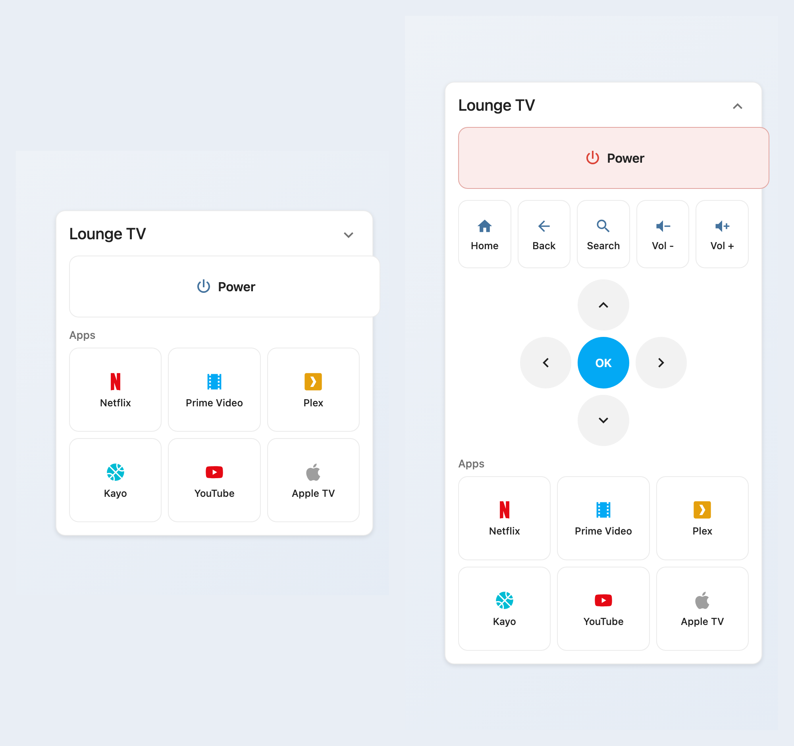

# Android TV Remote Card

<p align="center">
  
</p>

One-card remote control + app launcher for a single Android TV / Google TV connected to Home Assistant via the **androidtv_remote** integration.

- **Collapses to Power + apps when the TV is off**, and auto-expands to the full remote when it's on — with a chevron to expand/collapse manually anytime (`collapsible`, on by default)
- **Tap an app to power on and launch it** in one press (tap Power to just toggle the TV)
- Full remote when expanded: **Home, Back, Search** (opens the TV's on-screen keyboard), **Volume −/+**, and a **D-pad** (up/down/left/right/OK) via `remote.send_command` (`dpad`, on by default)
- **Reactive power button** — lit red when the TV is on, muted when off
- GUI-editable grid of app shortcuts (Netflix, Prime Video, Plex, YouTube, Disney+, Apple TV, Spotify, or anything installed) that launch via `media_player.play_media`
- The currently-foregrounded app (from the media_player's `app_id` attribute) is highlighted live
- Mushroom-ish flat card style, full GUI editor, no YAML required

Companion card to [heos-multiroom-card](https://github.com/mycrouch/heos-multiroom-card).

## Installation (HACS)

1. HACS → three-dot menu → **Custom repositories**
2. Add `https://github.com/mycrouch/androidtv-remote-card`, category **Dashboard** (Lovelace)
3. Install, then hard-refresh the browser.

The resource is served at `/hacsfiles/androidtv-remote-card/androidtv-remote-card.js`.

## Configuration

| Option   | Required | Description                                         |
| -------- | -------- | --------------------------------------------------- |
| `entity` | yes      | The TV `media_player` entity                        |
| `remote` | no       | The `remote.` entity, for nav/volume/D-pad commands  |
| `name`   | no       | Card title override                                 |
| `collapsible` | no  | Collapse to Power + apps when the TV is off; auto-expand when on (default `true`) |
| `dpad`   | no       | Show the D-pad (default `true` when `remote` is set) |
| `apps`   | no       | List of `{ name, icon, package, color }` app shortcuts |

Each app's `color` is an optional Home Assistant named palette colour (`red`, `light-blue`, `orange`, `cyan`, `green`, `grey`, …), rendered through the theme's `--<name>-color` tokens so it stays consistent with your theme. Omit it for the default icon colour.

Apps launch via `media_player.play_media` on the `androidtv_remote` entity. Set `package` to either an **application ID** (e.g. `com.netflix.ninja` — launched as `media_content_type: app`) or a **deep link** containing `://` (e.g. `netflix://`, `https://www.youtube.com` — launched as `media_content_type: url`). Nav and volume buttons use `remote.send_command` on the `remote` entity.

### Example

```yaml
type: custom:androidtv-remote-card
entity: media_player.lounge_tv
remote: remote.lounge_tv
apps:
  - name: Netflix
    icon: mdi:netflix
    package: com.netflix.ninja
    color: red
  - name: Plex
    icon: mdi:plex
    package: com.plexapp.android
    color: orange
```

## License

MIT — Jason Crouch. Icons: Material Design Icons via `ha-icon`.
